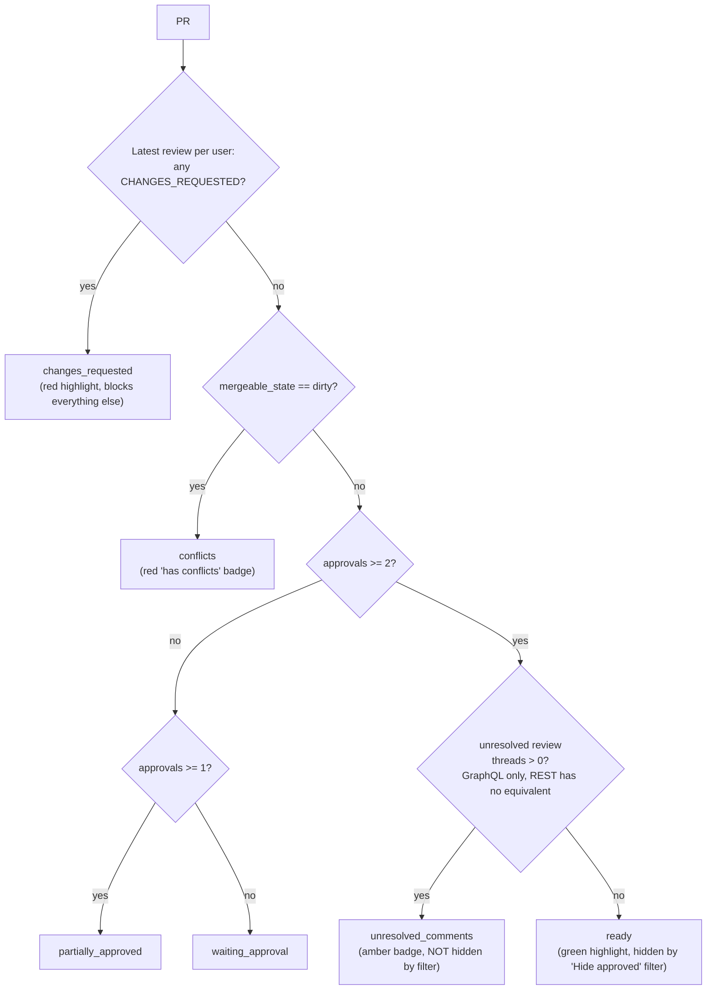

# PR readiness rules

Single source of truth: [`shared/pr-rules.js`](../shared/pr-rules.js) (synced to
[`frontend/src/pr-rules.js`](../frontend/src/pr-rules.js) via `sync.sh`).

This is the decision tree used by the "Active PRs" cards (badge + highlight color) and the
"Hide approved" filter in [`ui.js`](../shared/ui.js) (`createPRCard`, `getPRReadiness`).

**Rule when you touch `pr-rules.js`:** update this diagram in the same change. If the code and
diagram disagree, the code wins and the diagram is stale — treat that as a bug to fix, not a fact
to document.

## Decision tree

## Why this exists

Two real cases exposed why a bare `approvals >= 2` check is wrong:

- A PR with 2 approvals can still have an outstanding **CHANGES_REQUESTED** review from a third
  reviewer — GitHub doesn't clear that until the same reviewer re-reviews. Counting only the
  *latest* review per user (not just "any review ever") is required to detect this correctly, and
  it must take priority over approval count.
- A PR with 2 approvals can still have **unresolved conversations** (unresolved review comment
  threads) that block a real merge. The REST API has no field for this — only the GraphQL
  `reviewThreads { isResolved }` field exposes it (`fetchUnresolvedThreadCount` in `github.js`).
  To limit GraphQL calls, this is only fetched once a PR already has >= 2 approvals.

## Where each state is used

| State | Badge | Card highlight | Hidden by "Hide approved" filter |
|---|---|---|---|
| `changes_requested` | "changes requested" (red) | red left border | no |
| `conflicts` | "has conflicts" (red) | none | no |
| `unresolved_comments` | "N unresolved comments" (amber) | none | no |
| `ready` | "ready to merge" (green) | green left border | **yes** |
| `partially_approved` | "N of 2 approvals" (amber) | none | no |
| `waiting_approval` | "0 of 2 approvals" (red) | none | no |
